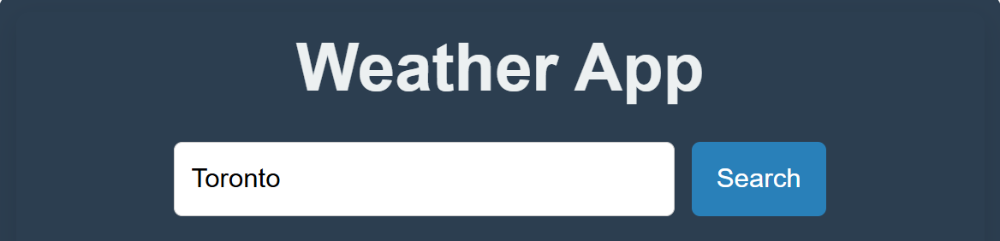
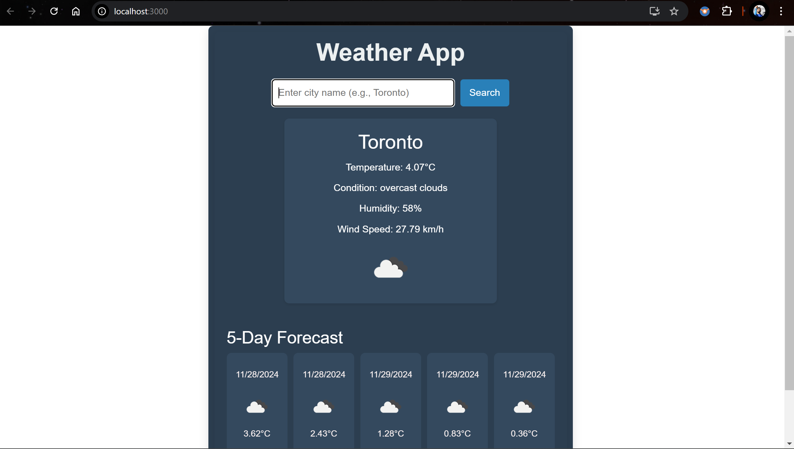

Name :- Vatsal Prajapati
Student Id:- 101414010

What I have done for the labtest - 
Screens: 
Setup for the ReactJs App
   

For the next step I created an account on OpenWeatherMap for API fetching,
afterwards I generated my API_KEY - 

Moving on, I have used React features like state, hooks, and lifecycle methods.
- State management using useState 
- Lifecycle methods like useEffect for data fetching 
- Hooks (like useEffect for fetching data when the component loads) 

For UI/UX-
I have make use of icons, themes and fonts

Then I have used Search by City feature to update based on user input.

My final display of the app

Postman response

